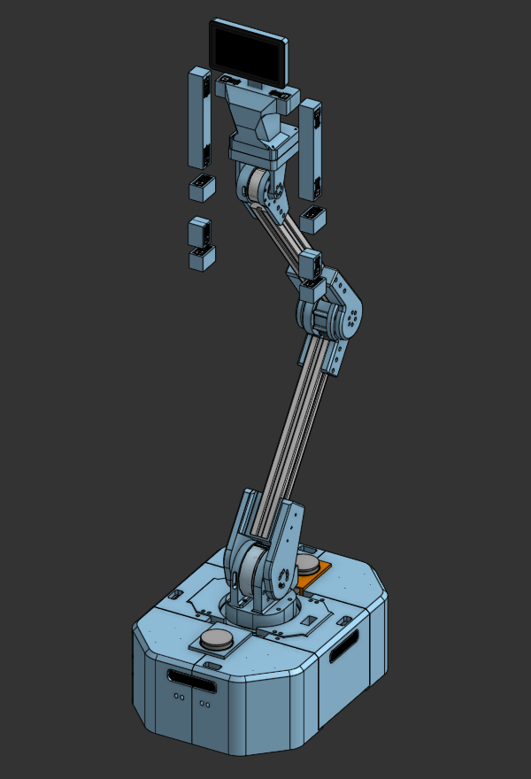

# AIZEE - open-source wheeled humanoid platform



OnShape Link: https://cad.onshape.com/documents/191b8a861f2900918f30776f/w/8fcf08900b23701d0eff1c6a/e/fcb77dc7adbafb5b753006f3

A modular robotics software stack for teleoperation, autonomous navigation, and multi-sensor data fusion.

## Project Vision

AIZEE is a mobile manipulation platform designed for real-time control, rich sensor integration, and reproducible data logging. The system enables both human teleoperation and autonomous behaviors while maintaining deterministic low-latency control loops for precise manipulation tasks.

## Hardware Specifications

### Compute Architecture
- **Main Controller**: NVIDIA Jetson Orin Nano
  - Runs motor control (Rust), orchestration, and data aggregation
  - CAN bus interface for motor communication
  - ZeroMQ hub for inter-process communication

- **Camera Nodes**: 4× Raspberry Pi 4
  - Each running Intel RealSense D455 camera
  - Streams RGB-D + IMU data over PoE network
  - Distributed processing architecture

### Actuation
- **9× ROBSTRIDE Motors** (CAN bus)
  - **Base (3 motors)**:
    - 2× ROBSTRIDE04: Left/right drive wheels (high torque)
    - 1× ROBSTRIDE03: Base swivel joint
  - **Gantry Arm (6 motors, 6DoF)**:
    - 1× ROBSTRIDE04: gantry_base (shoulder yaw, high torque)
    - 1× ROBSTRIDE03: gantry_mid (shoulder pitch, medium torque)
    - 1× ROBSTRIDE02: gantry_end (elbow pitch)
    - 1× ROBSTRIDE02: wrist_pitch
    - 1× ROBSTRIDE00: wrist_roll (micro motor)
    - 1× ROBSTRIDE00: gripper (micro motor)

- **Control Frequencies**:
  - Arm joints (6 motors): 1 kHz deterministic loop
  - Base (wheels + swivel, 3 motors): 100 Hz

### Sensors
- **4× Intel RealSense D455**
  - RGB: 1280×720 @ 30fps
  - Depth: 1280×720 @ 30fps
  - IMU: 200 Hz (accelerometer + gyroscope)

- **2× SLAMTEC RPLiDAR A1** (future integration)
  - 360° scanning
  - 8m range

### Networking
- Gigabit Ethernet with PoE switch
- Static IP allocation for deterministic routing
- ZeroMQ over TCP for pub/sub messaging

## Software Architecture

### Core Technologies
- **Rust**: Low-level motor control, CAN protocol, deterministic loops
- **Python**: Teleop interfaces, camera nodes, data bridges
- **ZeroMQ**: Inter-process communication (command/telemetry)
- **Rerun**: Real-time visualization and MCAP logging
- **PyO3**: Rust→Python bindings for performance-critical paths

### System Components

```
┌─────────────┐
│   Teleop    │ (Python, joystick/keyboard)
│   Station   │
└──────┬──────┘
       │ ZMQ commands (20 Hz)
       ▼
┌─────────────────────────────────────────┐
│        Jetson Orin Nano                 │
│  ┌──────────────────────────────────┐  │
│  │  Motor Control (Rust)            │  │
│  │  - CAN bus driver                │  │
│  │  - 1kHz arm control loop         │  │
│  │  - Safety watchdog               │  │
│  └───────┬──────────────────────────┘  │
│          │ ZMQ telemetry (50 Hz)       │
│  ┌───────▼──────────────────────────┐  │
│  │  Rerun Bridge (Python)           │  │
│  │  - Aggregates all data streams   │  │
│  │  - MCAP logging                  │  │
│  │  - Real-time visualization       │  │
│  └───────▲──────────────────────────┘  │
└──────────┼──────────────────────────────┘
           │ ZMQ camera streams (30 Hz)
     ┌─────┴─────┬─────────┬─────────┐
     ▼           ▼         ▼         ▼
┌─────────┐ ┌─────────┐ ┌─────────┐ ┌─────────┐
│  RPi 4  │ │  RPi 4  │ │  RPi 4  │ │  RPi 4  │
│ Camera  │ │ Camera  │ │ Camera  │ │ Camera  │
│  Node   │ │  Node   │ │  Node   │ │  Node   │
└─────────┘ └─────────┘ └─────────┘ └─────────┘
```

## Repository Structure

```
aizee/
├── rust/               # Rust workspace
│   ├── motor_control/  # CAN driver + control loops
│   ├── comms/          # ZeroMQ abstractions
│   └── bindings/       # PyO3 Python bindings
├── python/
│   ├── aizee/          # Main Python package
│   ├── teleop/         # Teleoperation interface
│   └── nodes/          # RPi camera streaming nodes
├── urdf/               # Robot URDF from OnShape
├── config/             # Hardware parameters (YAML)
├── logs/               # MCAP recordings
└── docs/               # Documentation
```

## Development Status

**Current Phase**: Phase 6 - Extensions Complete ✅

All major subsystems deployed and operational:
- ✅ Rust motor control (1kHz arm, 100Hz base)
- ✅ Python teleop interface with multi-module support
- ✅ 4× RPi camera nodes (Intel RealSense D455)
- ✅ 2× RPLiDAR A1M8 sensors
- ✅ UPS battery monitoring (INA219)
- ✅ Rerun visualization and MCAP logging

See [Implementation Phases](docs/PHASES.md) for complete roadmap.

## Quick Start

See [docs/quickstart/](docs/quickstart/) for detailed setup guides:
- **[QUICK_START_MULTIDEVICE.md](docs/quickstart/QUICK_START_MULTIDEVICE.md)**: 10-minute multi-device deployment
- **[JETSON_QUICK_START.md](docs/quickstart/JETSON_QUICK_START.md)**: Jetson Orin Nano setup
- **[QUICK_START_AFTER_REBOOT.md](docs/quickstart/QUICK_START_AFTER_REBOOT.md)**: Post-reboot startup

### Prerequisites
- NVIDIA Jetson Orin Nano with JetPack 6.x
- 4× Raspberry Pi 4 (camera nodes)
- 1× Raspberry Pi 4 (arm module, optional)
- Rust toolchain (stable)
- Python 3.10+

### Basic Installation
```bash
# Clone repository
git clone https://github.com/ltrlab/aizee.git
cd aizee

# Install Python dependencies
pip install -r requirements.txt

# Deploy to Jetson
./scripts/deploy_jetson_rover.sh

# Deploy to camera nodes
./scripts/deploy_all_cameras.sh
```

### Running the System
```bash
# Start all modules
./scripts/start_all_modules.sh

# Run teleop from dev machine
python python/teleop/teleop.py

# View live data
python python/rerun_bridge.py
```

## Documentation

- **[CLAUDE.md](CLAUDE.md)**: Comprehensive guide for Claude Code development
- **[docs/](docs/)**: Technical documentation
  - [docs/subsystems/](docs/subsystems/): Camera, LiDAR, UPS system docs
  - [docs/deployment/](docs/deployment/): Multi-device deployment guides
  - [docs/quickstart/](docs/quickstart/): Quick start guides
  - [docs/PHASES.md](docs/PHASES.md): Implementation roadmap

## License

MIT License - see [LICENSE](LICENSE) file for details.

## Contributing

This is an active research project. Contributions welcome!

## Contact

LTRLABS - [GitHub](https://github.com/ltrlab)
