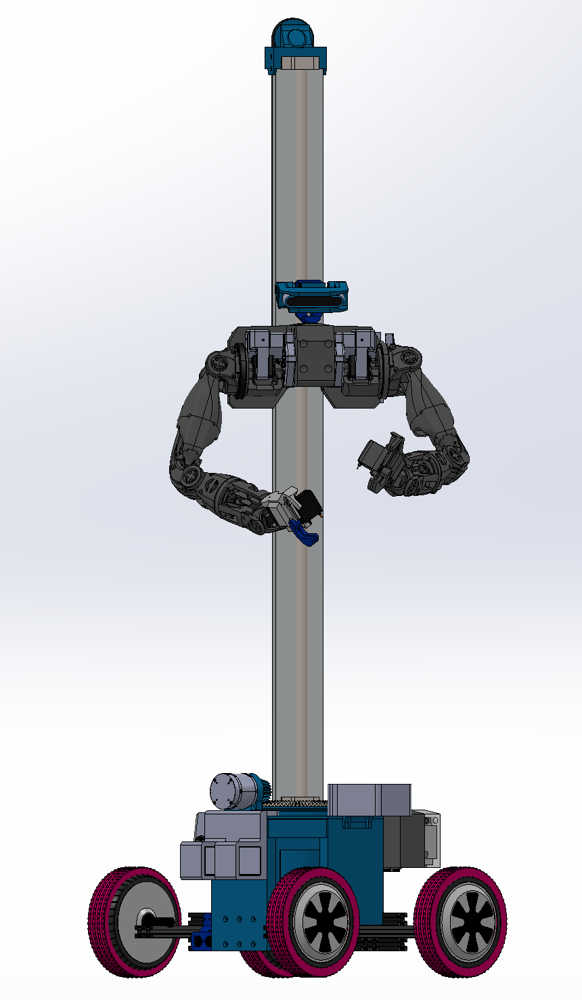
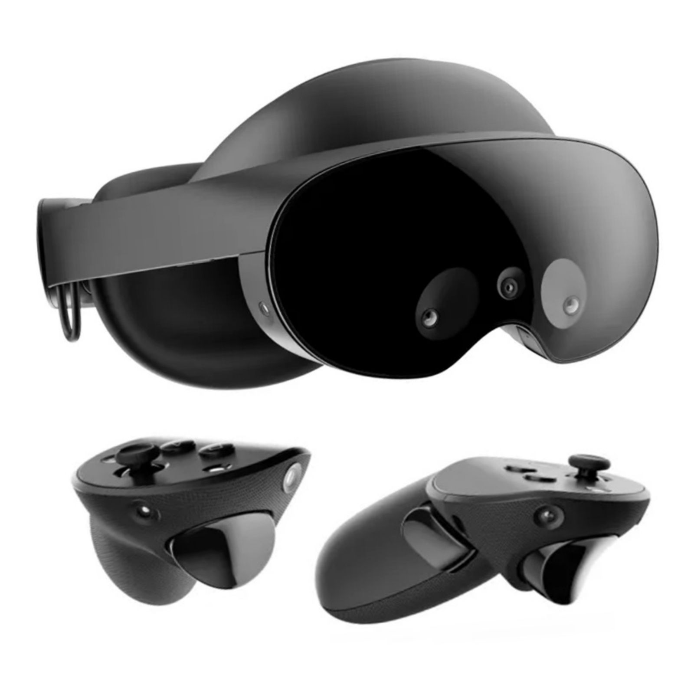
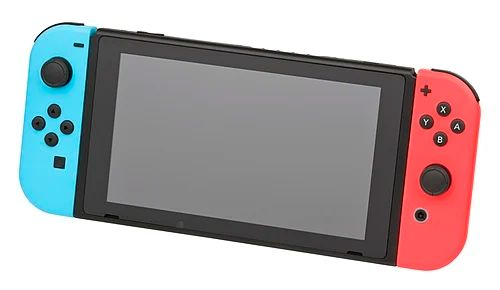
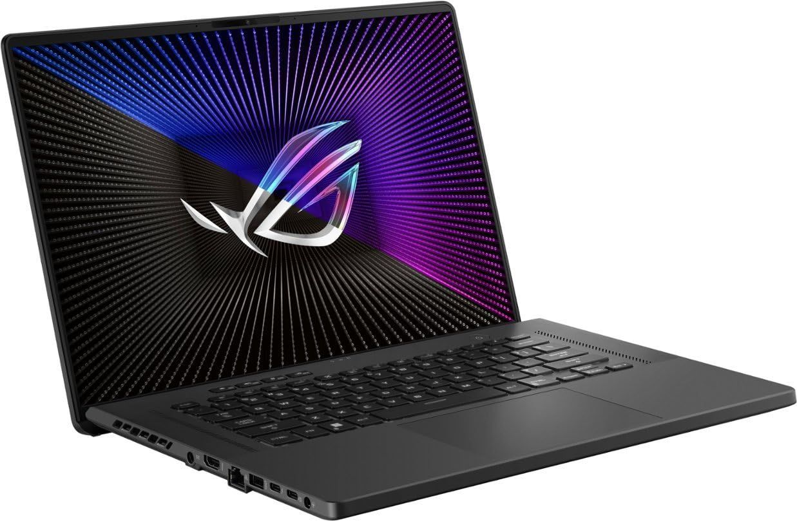

# AIZEE - OpenSauce 2025 #250372 
Mobile Humanoid Teleoperation Platform.

This repository contains all the code necessary to operate AIZEE for a teleoperation demo at Open Sauce 2025. The workspaces are broken into folders for their respective machines.



## Quick Links
| [Confluence Page](https://ltrlabs.atlassian.net/wiki/x/AYDpC) | [Mechanical Design](https://ltrlabs.atlassian.net/jira/software/projects/HD/boards/1/backlog) | [Software Development](https://ltrlabs.atlassian.net/jira/software/projects/SW/boards/2/backlog) | [Logistics Plan](https://ltrlabs.atlassian.net/jira/software/projects/LOGIC/boards/6/backlog) |
|---|---|---|---|

# Quick Setup
- Clone this repository.
```bash
git clone https://github.com/ltrlab/aizee.git
cd aizee
./start-demo
```

# Directory Structure
```
aizee/                            ← Root of the repository
├── .github/
│   ├── ISSUE_TEMPLATE.md         ← Bug report & feature request templates
│   └── PULL_REQUEST_TEMPLATE.md  ← Pull request template for Jira linking
│
├── README.md                     ← Landing page
│
├── docs/                         ← Project documentation & assembly
│   ├── ASSEMBLY.md               ← Full assembly guide.
│   └── wiring_diagrams/
│       └── platform_wiring.pdf
│
├── BOM/
│   └── BOMV1.5.md                ← Full parts list for V1.5
│   └── BOMV1.md                  ← Full parts list for V1
│   └── README.md                 ← Both in one place.
│
├── jetson_ws/                    ← ROS 2 workspace for everything on Jetson
│
├── windows_ws/                   ← All files that will be running on a Windows machine.
│   └── unity_ws/                 ← The Unity project workspace.
│
├── teensy/                       ← All code that lives on the Teensy 4.1
└── .gitignore                    ← Standard ignores (build artifacts, temp files)
```
# Bill of Materials
The total cost of this robot is roughly $2,000 depending on your region. The complete parts list along with some suppliers for each part lives here:
### [V1 BOM](BOM/BOM_V1.md)
### [V1.5 BOM](BOM/BOM_V1.5.md)


# Getting Started

1. **Prepare your hardware**
    - 3D-print all parts in design/CAD/exports/ (STL files).
    - Assemble the frame according to docs/ASSEMBLY.md.
    - Wire Jetson Orin Nano Super ↔ Teensy 4.1 using wiring diagrams in docs/wiring\_diagrams/.
    - Install four hoverboard motors onto the mobile platform (see assembly images).
2. **Jetson Software Setup**
    - Install Ubuntu 22.04 LTS on the Jetson Orin Nano Super.
      
    ```bash
    sudo apt update && sudo apt install curl gnupg lsb-release
    sudo curl -sSL https://raw.githubusercontent.com/ros/rosdistro/master/ros.asc | sudo apt-key add -
    sudo sh -c 'echo "deb http://packages.ros.org/ros2/ubuntu $(lsb\_release -cs) main" > /etc/apt/sources.list.d/ros2-latest.list'
    sudo apt update && sudo apt install ros-humble-desktop
    ```
    - Clone this repo and build:
      
    ```bash
    cd ~/aizee/jetson_ws
    colcon build
    source install/setup.bash
    ```
4. **Teensy Firmware**
    *   Install Teensyduino (latest).
    *   Open teensy/src/aizee_rover_teensy_firmware.c in Arduino IDE.
    *   Select “Teensy 4.1” as the board, compile and upload.
6. **Run the Teleoperation Demo**
   ```bash
   cd ~/aizee/jetson_ws
   source install/setup.bash
   ros2 launch aizee_control teleop.launch.py
   ```
   - On Windows (Unity + Oculus):
        1.  Start Unity application.
        2.  Ensure you’re on the same Wi-Fi network as the Jetson.
        3.  Launch the Unity application.
    
# Controls and Operation

The AIZEE teleoperation demo can be controlled using various interfaces, including a Meta Quest Pro VR headset, a Nintendo Switch, or a laptop. The robot is equipped with a RPLIDAR A1M8 for environment mapping and navigation and Intel RealSense D415 for depth perception.

## Validate Functionality

### Operating the Nintendo Switch Controller
- **Left Joystick**: Move the robot forward/backward and turn left/right.
- **Right Joystick**: Control the camera pitch and yaw.
- **A Button**: Toggle the camera view.
- **B Button**: Toggle the robot's lights.
- **X Button**: Toggle the robot's arm.
- **Y Button**: Toggle the robot's gripper.
- **Right Bumper**: Enable the robot.

### Running the RPLIDAR A1M8

In `/jetson_ws/src/rplidar_ros`

```
ros2 launch rplidar_ros view_rplidar_a1_launch.py
```

## User Interfaces

AIZEE can be controlled using multiple interfaces, with two primary options available for public interaction:

### 1. Meta Quest Pro



- **Control Method:** VR controllers teleoperate AIZEE’s arms; head movement mirrors to AIZEE’s head.
- **Display:** Shows a 3D depth preview of AIZEE’s environment.
- **Fit & Comfort:** Sits slightly above the nose, adjustable IPD dial, works with glasses, and can be worn around the neck.
- **Battery:** Lasts 2–3 hours; requires portable batteries for extended use. Can be used while charging but may get hot.
- **Pass-through:** Decent but can be jittery.
- **Controllers:** May lose tracking or switch to hand tracking; battery life is limited. Hand tracking and backup headsets are available as alternatives.
- **Operating Note:** For hygiene and convenience, consider using tape over the face sensor to allow control without wearing the headset. **Must clean with wipe after each use.**

### 2. Nintendo Switch (Ubuntu)



- **Control Method:** Touchscreen interface with controls for AIZEE, telemetry, and camera feed.
- **System:** Runs L4T Ubuntu 16.04 and ROS2 Eloquent.

### 3. Laptop (Windows)



- **Role:** Main monitoring and control station for the demo operator.
- **Features:** Manual control interface for troubleshooting and management.

---

## AIZEE Control Modes

| Mode                      | Meta Quest Pro                | Nintendo Switch (Ubuntu) | Laptop (Windows)         |
|---------------------------|-------------------------------|--------------------------|--------------------------|
| Head                      | Follow VR Head                | Manual Control           | Manual Control           |
| Arms                      | Mirror VR Hands/Controllers   | Manual Control           | Manual Control           |
| Vertical                  | Follow VR Head Height         | Manual Control           | Manual Control           |
| Rotate                    | Follow VR Body Estimate       | Manual Control           | Manual Control           |
| Rover                     | Select Target and Move        | Manual Control           | Manual Control           |
| Follow VR Head            | ✔️                            |                          |                          |
| Grab Drag/Rotate          | ✔️                            |                          |                          |
| Follow Eye Tracking       | Auto Select with Gaze Prediction |                          |                          |
| Mirror VR Hands/Controllers | ✔️                          |                          |                          |
| Manual Control            | ✔️                            | ✔️                       | ✔️                       |

**Note:** Some features (like eye tracking and advanced VR controls) are exclusive to the Meta Quest Pro interface. All interfaces support manual control for redundancy and troubleshooting.